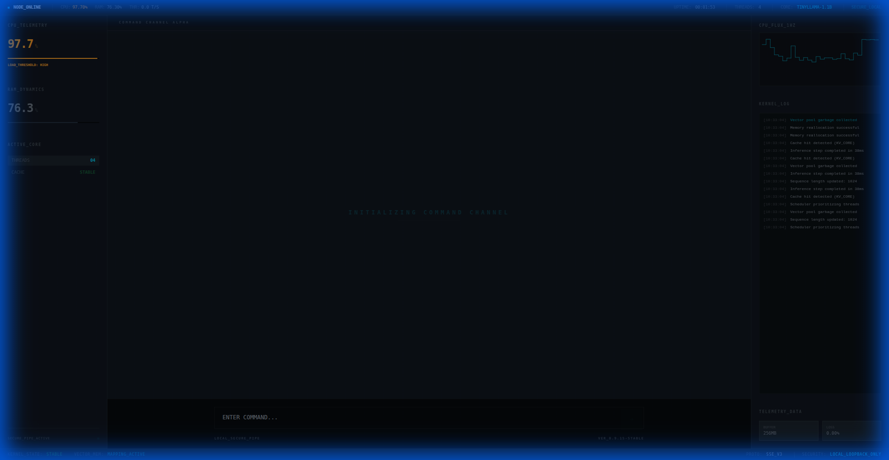

# 🤖 Local Tactical Terminal

**This is a personal AI project that runs entirely on your own computer.**

It’s built to be fast, private, and look like a sci-fi interface. No internet required, no subscription fees, just raw compute.

## What is it?

It has two main parts:

1.  **🧠 The Brain (Backend)**: A custom engine that runs the AI model efficiently on your CPU. It handles the thinking and memory.
2.  **🖥️ The Interface (Frontend)**: A futuristic, "tactical" chat window where you talk to the AI. It visualizes what your computer is doing in real-time.

## Why?

To have a powerful, uncensored, and private AI assistant that lives locally on your machine, wrapped in a cool aesthetic.
